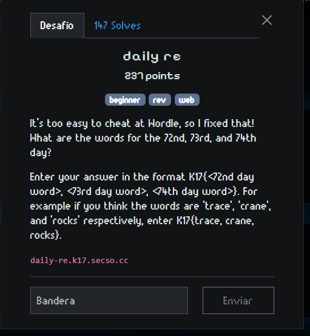
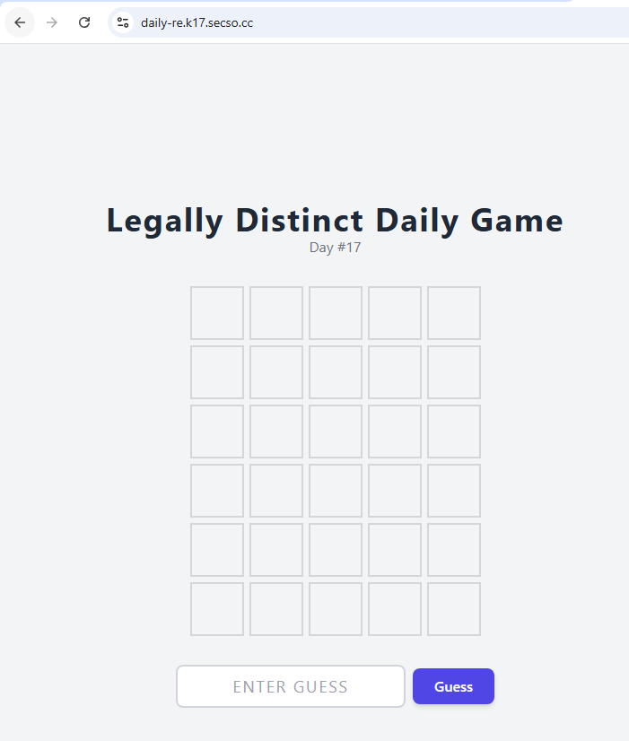
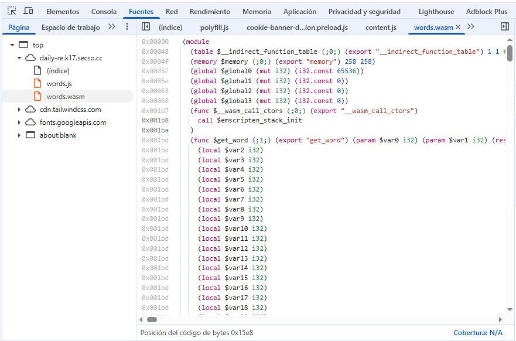
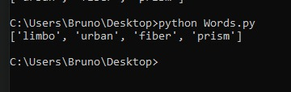

# Write-up: Legally Distinct Daily Game (Web + Reversing)

## Introducción
Este reto consistió en descubrir las palabras diarias que el juego **"Legally Distinct Daily Game"** usa para los días 72, 73 y 74, con el objetivo de obtener la flag en el formato:

## Descripción del reto
Se nos daba acceso a una página web con un juego estilo *Wordle* que mostraba únicamente la palabra del día actual, sin revelar las palabras de días anteriores ni posteriores.  
La pista del reto indicaba que no se podía hacer trampa fácilmente, por lo que debíamos investigar cómo se generaban las palabras de cada día.

## Proceso de resolución

### Investigación inicial
- Se consultaron listas públicas conocidas de Wordle y sus variantes.  
- Ninguna coincidía con las palabras esperadas para la flag.

### Análisis del archivo `words.wasm`
- Al inspeccionar el código fuente de la página con DevTools, se encontró un archivo llamado `words.wasm` que contenía la lógica del juego y el conjunto completo de palabras.  
- Se identificó una sección de datos que contenía las palabras codificadas.

### Extracción de las palabras
- Se utilizó un script en Python (`Words.py`) para extraer las palabras del segmento de datos dentro del `.wasm`.  
- Se aplicó una expresión regular para filtrar todas las palabras de 5 letras.
- Finalmente, se obtuvieron las palabras correspondientes a los días solicitados:

| Día | Palabra |
|-----|---------|
| 72  | limbo   |
| 73  | urban   |
| 74  | fiber   |

### Validación y flag
- Combinando las palabras obtenidas, la flag final es: K17{limbo, urban, fiber}

