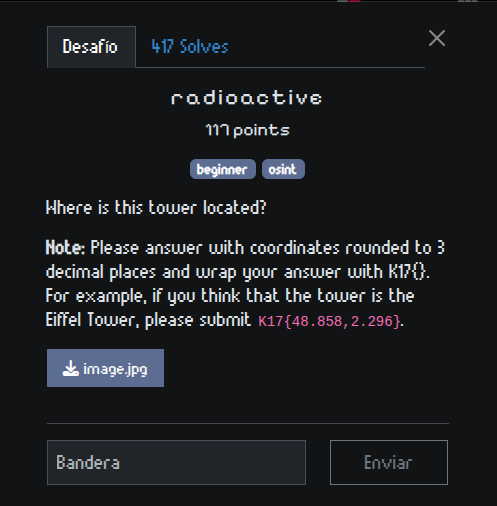
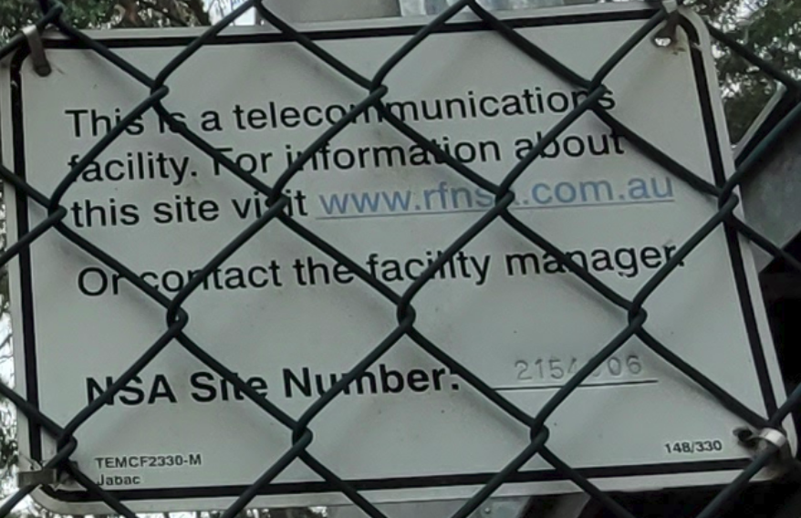
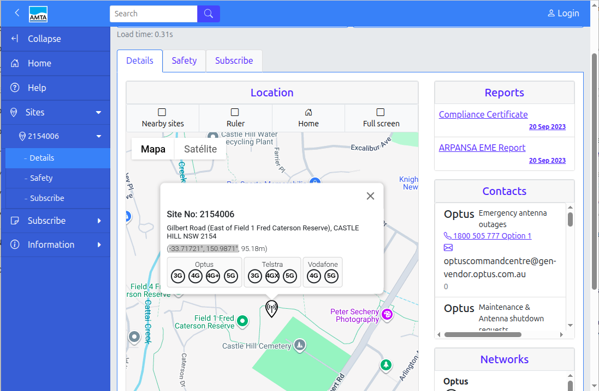
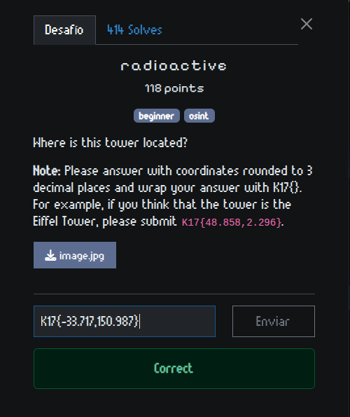

# Writeup -- CTF K17: radioactive

{width="13.148cm"
height="13.386cm"}

El reto nos proporcionaba una **imagen de una torre de
telecomunicaciones** con un cartel colocado detrás de una reja.

{width="17cm"
height="22.666cm"}

Haciendo zoom en el cartel se podía leer:

{width="17cm"
height="10.998cm"}

*This is a telecommunications facility. *

*For information about this site visit www.rfns\*.com.au *

*Or contact the facility manager. *

*NSA Site Number: 2154\*06*

Los asteriscos indican caracteres ilegibles debido a la reja.

### Paso 1: Recuperar el dominio

La primera pista estaba en la línea del cartel que mencionaba el **NSA
Site Number.**\
Con esto se podía deducir que el dominio incompleto *www.rfns\*.com.au*
en realidad era:

[*www.rfnsa.com.au*](http://www.rfnsa.com.au/)

### Paso 2: Descifrar el número de sitio

El cartel mostraba el número de sitio:

*2154\*06*

La dificultad era que uno de los dígitos estaba oculto tras la reja.
Probando distintas combinaciones, resultó que el número correcto era:

*2154006*

### Paso 3: Buscar en el portal

Ingresando al portal [**www.rfnsa.com.au**](https://www.rfnsa.com.au/)
se encuentra un buscador para ingresar el **NSA Site Number**.\
Al colocar *2154006*, el sistema muestra la ubicación exacta de la torre
de telecomunicaciones en Australia. En la pagina:

<https://www.rfnsa.com.au/2154006/detail>

{width="17cm"
height="11.125cm"}

### Paso 4: Formato de la flag

La descripción del reto indicaba que la flag debía tener el formato:

*K17{lat,lon}*

Donde *lat* y *lon* son las coordenadas de la torre con tres números
luego del punto decimal.\
Al consultar el sitio, las coordenadas obtenidas fueron:

**-33.71721°, 150.9871°**

Por lo tanto, la flag final es:

*K17{-33.717,150.987}*

{width="13.227cm"
height="15.739cm"}
